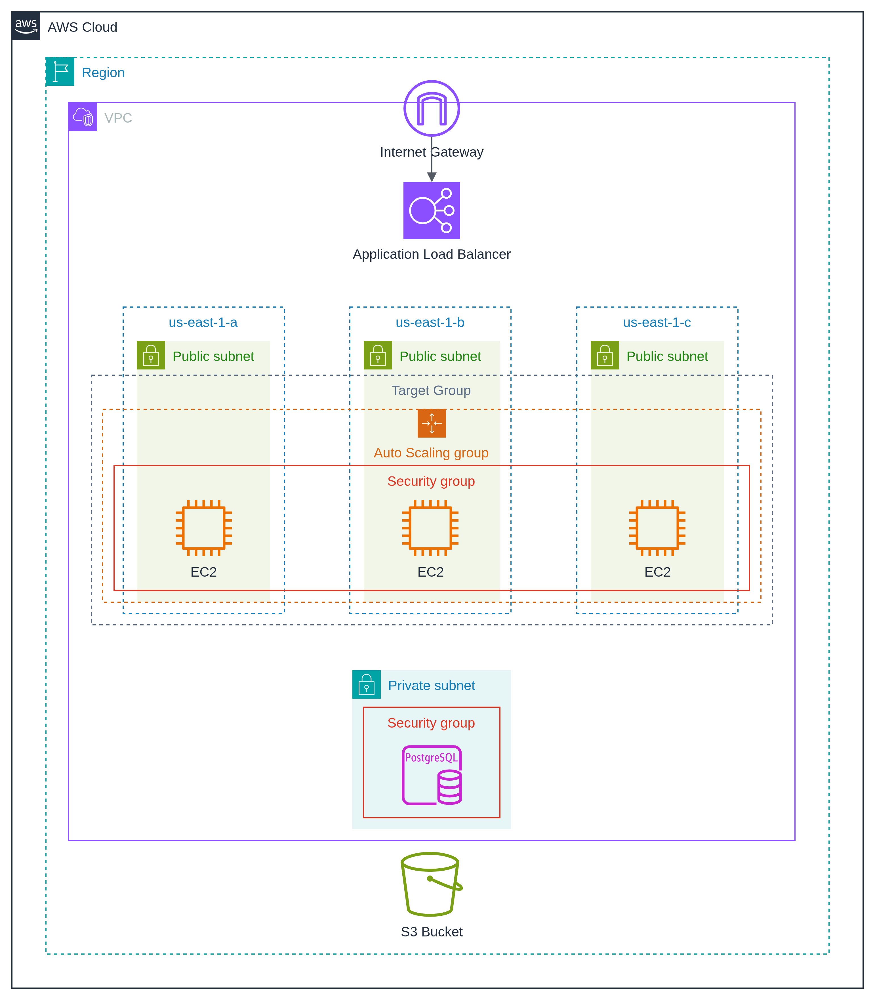

# Proyecto Final: Aplicación Web de Alta Disponibilidad en AWS

---

## 1. Presentación

En este proyecto final de Computación en la Nube, se diseñó y desplegó una **aplicación web** altamente disponible, escalable, de alto rendimiento y segura sobre servicios de AWS. El propósito es demostrar los conocimientos adquiridos durante el curso, aplicando los principios del **AWS Well-Architected Framework** (WAF), así como implementar aspectos de seguridad, red, escalabilidad y optimización de costos.

---

## 2. Introducción

Los objetivos principales de este proyecto son:

- Construir una **arquitectura en la nube** que se ajuste a los principios de seguridad, confiabilidad, desempeño, costo y excelencia operativa del WAF.
- Implementar una aplicación web distribuida con balanceo de carga y escalado automático.
- Separar capas de aplicación y base de datos, garantizando aislamiento y seguridad a través de grupos de seguridad y subredes adecuadas.
- Utilizar servicios gestionados de AWS para minimizar la sobrecarga operativa y optimizar costos.
- Entregar evidencia de la estimación de costos usando la **Calculadora de Precios de AWS** en la región `us-east-1` para 12 meses de funcionamiento.

---

## 3. Diagrama de Arquitectura

A continuación se presenta el diagrama arquitectónico de la solución desplegada:



<em>**Leyenda del diagrama:**</em>

1. **VPC (Virtual Private Cloud)**
    - Una red privada virtual que contiene subredes públicas y privadas distribuidas en tres Zonas de Disponibilidad (`us-east-1a`, `us-east-1b`, `us-east-1c`).
    - Una **Internet Gateway** (IGW) conecta la VPC con Internet.

2. **Subredes Públicas** (en cada AZ)
    - Cada subred pública aloja instancias EC2 que ejecutan la capa de aplicación.
    - Un **Application Load Balancer** (ALB) en la capa pública recibe tráfico desde Internet (a través de IGW) y lo distribuye a los servidores web.
    - Un **Auto Scaling Group** (ASG) gestiona dinámicamente el número de instancias EC2, garantizando escalabilidad horizontal.
    - Los **Grupos de Seguridad** (Security Groups) asociadas a las EC2 permiten únicamente tráfico entrante desde el ALB (puerto 80/443) y tráfico saliente hacia la base de datos.

3. **Subred Privada**
    - Aloja una base de datos **Amazon RDS for PostgreSQL** en modo Multi-AZ (si se requiere alta disponibilidad) o en una réplica dentro de la misma AZ.
    - Un **Grupo de Seguridad** específico para RDS restringe acceso únicamente a las instancias EC2 de la capa de aplicación (por IP o SG ID).

4. **S3 Bucket**
    - Un bucket de Amazon S3 fuera de la VPC, utilizado para almacenamiento de objetos estáticos (imágenes, archivos de usuario, backups, etc.).
    - Se aplican políticas de bucket (Bucket Policies) y roles de IAM para controlar permisos de lectura/escritura desde la capa de aplicación.

---

## 4. Estimación de Costos

Para estimar el costo de operación durante 12 meses en la región **us-east-1**, se utilizó la **Calculadora de Precios de AWS** siguiendo estos pasos:

1. Abrir la Calculadora de Precios:  
   https://calculator.aws/#/
2. Seleccionar región **Norte de Virginia (us-east-1)**.
3. Agregar los siguientes servicios y configurarlos según su uso en la solución:
    - **Amazon EC2** (instancias t3.medium, 3 AZs, horas estimadas de actividad).
    - **Elastic Load Balancer (Application Load Balancer)** (horas de balanceo + GB transferidos).
    - **Auto Scaling** (sin costo adicional, pero asociado al costo de las instancias EC2).
    - **Amazon RDS for PostgreSQL** (db.t3.small o db.t3.medium en modo Multi-AZ).
    - **Amazon S3** (almacenamiento de objetos, solicitudes PUT/GET estimadas).
    - **Datos transferidos (Bandwidth)** (estimación de GB mensuales de entrada/salida).
4. Revisar el **resumen de costos** para ver:
    - Costo mensual estimado de cada servicio.
    - Costo total proyectado para 12 meses.

> **Evidencia de la estimación:**
> - Captura de pantalla del resumen de la estimación (archivo: `estimacion-costos-aws.png`).
> - Archivo exportado de la calculadora en PDF o CSV (archivo: `estimacion-costos-aws.pdf`).
> - URL del estimado compartido públicamente (si aplica):
    >   ```
>   https://calculator.aws/#/estimate/<ID-de-tu-estimacion>
>   ```

> **Nota:** La estimación no incluye impuestos ni cargos adicionales de terceros.

---

## 5. Principios del AWS Well-Architected Framework (WAF)

La solución desplegada cumple con los cinco pilares del WAF. A continuación se describe cómo se implementan y satisfacen cada uno de ellos:

1. ### Excelencia Operativa (Operational Excellence)
    - **Infraestructura como Código (IaC):**
        - Todo el despliegue (VPC, subredes, IGW, subredes, grupos de seguridad, ALB, ASG, EC2, RDS, S3) se definió usando **Terraform** o **AWS CloudFormation**.
        - Facilita la replicación, versionado y auditoría de cambios en la infraestructura.
    - **Registro y Monitoreo:**
        - Se habilitó **Amazon CloudWatch** para recoger métricas de CPU, memoria, latencia del ALB y conexiones de RDS.
        - Logs de acceso del ALB y logs de aplicación (EC2) se almacenan en CloudWatch Logs para análisis y alertas.
    - **Automatización de Despliegue:**
        - Se utilizaron pipelines de CI/CD (por ejemplo, AWS CodePipeline / GitHub Actions) para desplegar nuevas versiones de la aplicación.
    - **Procedimientos Estandarizados:**
        - Documentación interna de runbooks para reinstalación rápida ante fallos y pruebas periódicas de recuperación.

2. ### Seguridad (Security)
    - **Control de Acceso y Mínimos Privilegios:**
        - Los **Grupos de Seguridad** de las instancias EC2 permiten solo tráfico entrante desde el ALB (puerto 80/443) y habilitan únicamente el puerto 5432 hacia la base de datos.
        - El **Grupo de Seguridad** de RDS solo acepta conexiones desde el Security Group de las EC2.
    - **Subred Privada para Base de Datos:**
        - RDS se encuentra en una **subred privada**, sin acceso directo desde Internet, reduciendo la superficie de ataque.
    - **Roles de IAM y Políticas Restrictivas:**
        - Se definieron Roles de IAM para dar a las instancias EC2 permisos mínimos para acceder a S3 (lectura/escritura solo al bucket específico).
        - Se habilitó **S3 Bucket Policies** estrictas para garantizar que solo el rol de la aplicación web pueda interactuar con el bucket.
    - **Cifrado en Tránsito y en Reposo:**
        - El tráfico entre ALB y EC2 se hace mediante HTTP/HTTPS (opcionalmente con certificados TLS gestionados por **AWS Certificate Manager**).
        - **RDS for PostgreSQL** con cifrado de datos en reposo (KMS) y cifrado en tránsito (SSL/TLS).
    - **Actualizaciones y Parches:**
        - Imágenes de Amazon Linux/Ubuntu actualizadas con parches de seguridad automáticos.
        - RDS gestionado por AWS garantiza aplicación de parches en mantenimiento programado.

3. ### Confiabilidad (Reliability)
    - **Alta Disponibilidad Multi-AZ:**
        - Las instancias de aplicación EC2 se distribuyen en tres zonas de disponibilidad (`us-east-1a`, `us-east-1b`, `us-east-1c`).
        - El **RDS** está configurado en modo Multi-AZ (réplica sincrónica para failover instantáneo).
    - **Auto Scaling y Load Balancing:**
        - **Auto Scaling Group** ajusta dinámicamente la cantidad de instancias EC2 según la demanda (por ejemplo, política basada en CPU).
        - El **Application Load Balancer** (ALB) enruta el tráfico entre múltiples instancias, detecta estados “unhealthy” y redirige a instancias sanas.
    - **Backups y Snapshot Automáticos:**
        - RDS configurado para generar **snapshots diarios** y retención de backups durante 7 días.
        - S3 puede configurarse para realizar versiones de objetos (Object Versioning) y Lifecycle Rules para archivar hacia Glacier.
    - **Pruebas de Resiliencia:**
        - Simulaciones de falla de instancias EC2 (terminar una instancia manualmente) para validar que ASG levanta reemplazos.
        - Pruebas de desconexión de una AZ para garantizar failover de RDS.

4. ### Eficiencia en el Desempeño (Performance Efficiency)
    - **Selección de Tipos de Instancia Adecuados:**
        - Para la capa de aplicación, se eligieron instancias de propósito general (t3.medium) que permiten ráfagas de CPU según la carga variable.
        - Para base de datos, se seleccionó una clase RDS con CPU y memoria acorde a la carga esperada.
    - **Elasticidad y Escalado Horizontal:**
        - Gracias a ASG, cuando la carga aumenta, se levantan nuevas instancias EC2; cuando la carga disminuye, se terminan instancias innecesarias.
    - **Cache y Distribución de Contenido (opcional):**
        - Se puede integrar **Amazon ElastiCache (Redis)** para cacheo de sesiones o consultas frecuentes.
        - **Amazon CloudFront** como CDN para servir contenido estático desde S3 con baja latencia.
    - **Optimización de la Base de Datos:**
        - Índices adecuados en PostgreSQL, particionamiento si las tablas crecen mucho y uso de réplicas de lectura (Read Replicas) si escalan las consultas de lectura.

5. ### Optimización de Costos (Cost Optimization)
    - **Escalado Automático para Ahorro:**
        - Al usar **Auto Scaling**, pagamos solo por las instancias EC2 necesarias según la demanda real.
        - Para ambientes de desarrollo o no pico, se puede reducir el mínimo de instancias a 1 o incluso dejar en 0 instancias mediante escalado dinámico.
    - **Instancias Reservadas o Savings Plans (opcional):**
        - Una vez establecida la carga promedio, se podría optar por **RIs** o **Savings Plans** para un uso más económico de EC2 y RDS.
    - **Uso de Capas Gratuitas y Servicios Serverless (opcional):**
        - Para componentes no críticos, se puede evaluar el uso de **AWS Lambda** en lugar de instancias EC2.
        - **AWS S3** para almacenamiento de objetos suele ser más económico que almacenar archivos en EC2.
    - **Monitoreo de Costos y Alertas:**
        - Se configuraron alarmas en **AWS Budgets** para recibir notificaciones cuando el gasto mensual supere un umbral predeterminado.
    - **Optimización de Datos en Tránsito:**
        - Emplear compresión en respuestas HTTP, minimizar transferencias entre regiones.

---

## 6. Contenido del Repositorio

El repositorio asociado a este proyecto contiene:

