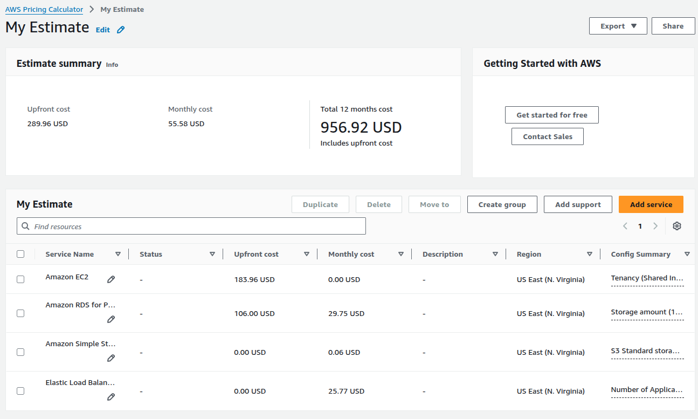

# Proyecto Final: Aplicación Web de Alta Disponibilidad en AWS

---

## 1. Presentación

En este proyecto final de Computación en la Nube, se diseñó y desplegó una aplicación web con alta disponibilidad en AWS. se eligio desplegar Strapi como aplicación web, una plataforma de gestión de contenido (CMS) que permite crear y administrar APIs de manera sencilla.

---

## 2. Introducción

Los objetivos principales de este proyecto son:

- Construir una **arquitectura en la nube** que sea altamente disponible, escalable y segura.
- Implementar una aplicación web distribuida con balanceo de carga y escalado automático.
- Separar capas de aplicación y base de datos, garantizando aislamiento y seguridad a través de grupos de seguridad y subredes adecuadas.
- Utilizar servicios gestionados de AWS para minimizar la sobrecarga operativa y optimizar costos.
- Entregar evidencia de la estimación de costos usando la **Calculadora de Precios de AWS** en la región `us-east-1` para 12 meses de funcionamiento.

---

## 3. Diagrama de Arquitectura

A continuación se presenta el diagrama arquitectónico de la solución desplegada:

<em>**Interpretación del Diagrama:**</em>

1. **VPC (Virtual Private Cloud)**
    - Una red privada virtual que contiene subredes públicas y privadas distribuidas en tres Zonas de Disponibilidad (`us-east-1a`, `us-east-1b`, `us-east-1c`).
    - Una **Internet Gateway** (IGW) conecta la VPC con Internet, para descargar actualizaciones y permitir acceso a la aplicación desde el exterior.

2. **Subredes Públicas** (en cada AZ)
    - Cada subred pública aloja instancias EC2 que ejecutan la capa de aplicación.
    - Un **Application Load Balancer** (ALB) en la capa pública recibe tráfico desde Internet (a través de IGW) y lo distribuye a los servidores web.
    - Un **Auto Scaling Group** (ASG) gestiona dinámicamente el número de instancias EC2, garantizando escalabilidad horizontal.
    - Los **Grupos de Seguridad** (Security Groups) asociadas a las EC2 permiten únicamente tráfico entrante desde el ALB (puerto 80/443) y tráfico saliente hacia la base de datos.

3. **Subred Privada**
    - Aloja una base de datos **Amazon RDS for PostgreSQL** en una sola AZ.
    - Un **Grupo de Seguridad** específico para RDS restringe acceso únicamente a las instancias EC2 de la capa de aplicación por security group id.

4. **S3 Bucket**
    - Un bucket de Amazon S3 para guardar archivos multimedia.
    - Se aplican políticas de bucket (Bucket Policies) y roles de IAM para controlar permisos de lectura/escritura desde la capa de aplicación.

---

## 4. Estimación de Costos

Para estimar el costo de operación durante 12 meses en la región **us-east-1**, se utilizó la **Calculadora de Precios de AWS**, los detalles de los precios se pueden encontrar en el siguiente enlace: https://calculator.aws/#/estimate?id=3e8c715d6ac4cbedd2e3769f37408105fc69a3e0.

