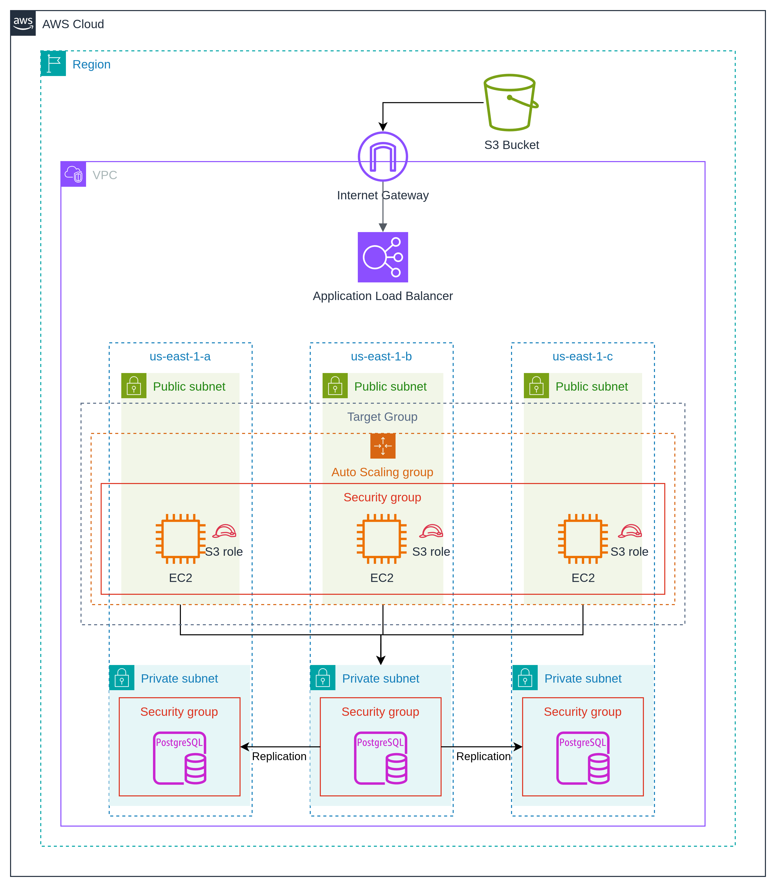
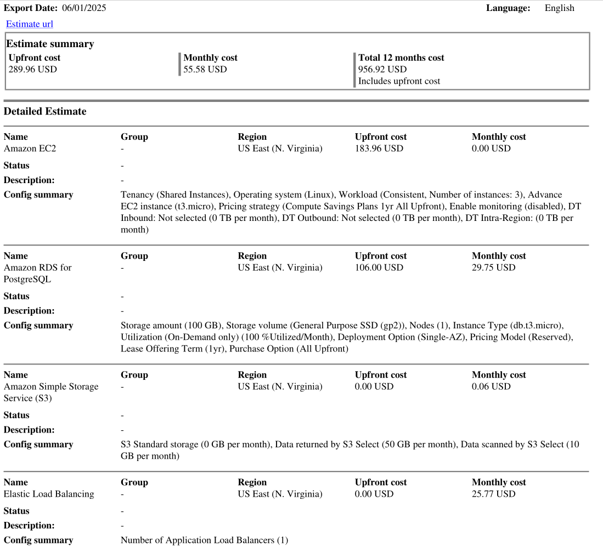

# Proyecto Final: Aplicación Web de Alta Disponibilidad en AWS

---

## 1. Presentación

En este proyecto final de Computación en la Nube, se diseñó y desplegó una aplicación web con alta disponibilidad en AWS. se eligio desplegar Strapi como aplicación web, una plataforma de gestión de contenido (CMS) que permite crear y administrar APIs de manera sencilla.

---

## 2. Introducción

Los objetivos principales de este proyecto son:

- Construir una **arquitectura en la nube** que sea altamente disponible, escalable y segura.
- Implementar una aplicación web distribuida con balanceo de carga y escalado automático.
- Separar capas de aplicación y base de datos, garantizando aislamiento y seguridad a través de grupos de seguridad y subredes adecuadas.
- Utilizar servicios gestionados de AWS para minimizar la sobrecarga operativa y optimizar costos.
- Entregar evidencia de la estimación de costos usando la **Calculadora de Precios de AWS** en la región `us-east-1` para 12 meses de funcionamiento.

---

## 3. Diagrama de Arquitectura

A continuación se presenta el diagrama arquitectónico de la solución desplegada:

<em>**Interpretación del Diagrama:**</em>

1. **VPC (Virtual Private Cloud)**

   - Una red privada virtual que contiene subredes públicas y privadas distribuidas en tres Zonas de Disponibilidad (`us-east-1a`, `us-east-1b`, `us-east-1c`).
   - Una **Internet Gateway** (IGW) conecta la VPC con Internet, para descargar actualizaciones y permitir acceso a la aplicación desde el exterior.

2. **Subredes Públicas** (en cada AZ)

   - Cada subred pública aloja instancias EC2 que ejecutan la capa de aplicación.
   - Un **Application Load Balancer** (ALB) en la capa pública recibe tráfico desde Internet (a través de IGW) y lo distribuye a los servidores web.
   - Un **Auto Scaling Group** (ASG) gestiona dinámicamente el número de instancias EC2, garantizando escalabilidad horizontal.
   - Los **Grupos de Seguridad** (Security Groups) asociadas a las EC2 permiten únicamente tráfico entrante desde el ALB (puerto 80/443) y tráfico saliente hacia la base de datos.

3. **Subred Privada**

   - Aloja una base de datos **Amazon RDS for PostgreSQL** en una sola AZ.
   - Un **Grupo de Seguridad** específico para RDS restringe acceso únicamente a las instancias EC2 de la capa de aplicación por security group id.

4. **S3 Bucket**
   - Un bucket de Amazon S3 para guardar archivos multimedia.
   - Se aplican políticas de bucket (Bucket Policies) y roles de IAM para controlar permisos de lectura/escritura desde la capa de aplicación.

---

## 4. Estimación de Costos

Para estimar el costo de operación durante 12 meses en la región **us-east-1**, se utilizó la **Calculadora de Precios de AWS**, los detalles de los precios se pueden encontrar en el siguiente enlace: https://calculator.aws/#/estimate?id=3e8c715d6ac4cbedd2e3769f37408105fc69a3e0.

---

## 5. Principios del AWS Well-Architected Framework (WAF)

La solución desplegada cumple con los cinco pilares del WAF. A continuación se describe cómo se relaciona cada uno de estos pilares:

1. ### Excelencia Operativa (Operational Excellence)

   - **Infraestructura como Código (IaC):**
     - Todo el despliegue (VPC, subredes, IGW, subredes, grupos de seguridad, ALB, ASG, EC2, RDS, S3) se definió usando **Terraform** esto facilita la replicación, versionado y auditoría de cambios en la infraestructura.
   - **Registro y Monitoreo:**
     - Por medio de **Amazon CloudWatch** se puede monitorear el estado de las instancias tanto en EC2 como en RDS.

2. ### Seguridad (Security)

   - **Control de Acceso y Mínimos Privilegios:**
     - Los **Grupos de Seguridad** de las instancias EC2 permiten solo tráfico entrante desde el ALB (puerto 80) y habilitan únicamente el puerto 5432 hacia la base de datos.
     - El **Grupo de Seguridad** de RDS solo acepta conexiones desde el Security Group de las EC2.
   - **Subred Privada para Base de Datos:**
     - RDS se encuentra en una **subred privada**, sin acceso directo desde Internet, reduciendo la superficie de ataque.
   - **Roles de IAM y Políticas Restrictivas:**
     - Se definieron Roles de IAM para dar a las instancias EC2 permisos mínimos para acceder a S3 (lectura/escritura solo al bucket específico).

3. ### Confiabilidad (Reliability)

   - **Alta Disponibilidad Multi-AZ:**
     - Las instancias de aplicación EC2 se distribuyen en tres zonas de disponibilidad (`us-east-1a`, `us-east-1b`, `us-east-1c`).
   - **Auto Scaling y Load Balancing:**
     - **Auto Scaling Group** ajusta dinámicamente la cantidad de instancias EC2 según la demanda.
     - El **Application Load Balancer** (ALB) enruta el tráfico entre múltiples instancias, detecta estados “unhealthy” y redirige a instancias sanas.
   - **Pruebas de Resiliencia:**
     - Simulaciones de falla de instancias EC2 (terminar una instancia manualmente) para validar que ASG levanta reemplazos.

4. ### Eficiencia en el Desempeño (Performance Efficiency)

   - **Selección de Tipos de Instancia Adecuados:**
     - Para la capa de aplicación, se eligieron instancias de propósito general (t3.micro) que soportan cargas de trabajo adecuadas para la aplicacion Strapi que esta ejecutandose.
     - Para base de datos, se seleccionó una clase RDS con CPU y memoria acorde a la carga esperada.
   - **Elasticidad y Escalado Horizontal:**
     - Gracias a ASG, cuando la carga aumenta, se levantan nuevas instancias EC2; cuando la carga disminuye, se terminan instancias innecesarias.

5. ### Optimización de Costos (Cost Optimization)
   - **Escalado Automático para Ahorro:**
     - Al usar **Auto Scaling**, pagamos solo por las instancias EC2 necesarias según la demanda real.
     - Para ambientes de desarrollo o no pico, se puede reducir el mínimo de instancias a 1
   - **Uso de Capas Gratuitas y Servicios Serverless (opcional):**
     - **AWS S3** para almacenamiento de objetos suele ser más económico que almacenar archivos en EC2.

---
